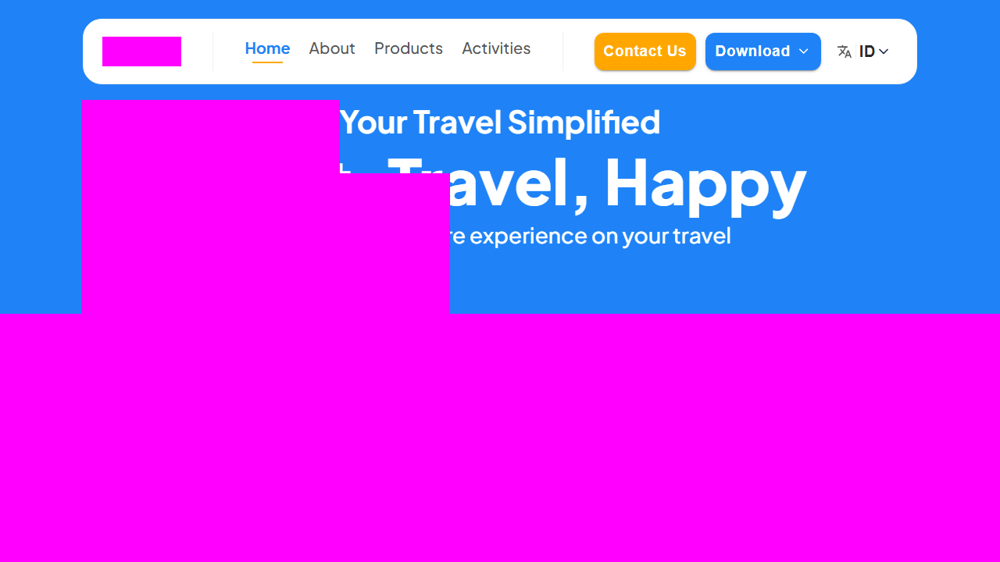

# mepo-playwright (NEW) Fully AI 🤖✨


Automation suite untuk `https://dev.mepo.travel/` dengan pendekatan modern: robust locators, POM, visual regression, dan external validation.  
Built to catch regressions before users do 🛡️

---

## Preview 👀

### Test Report Screenshot


### Animated Preview (MP4/WebM)
[](docs/assets/report-preview.mp4)
- Alternate format: [WebM](docs/assets/report-preview.webm)

---

## Bahasa Indonesia 🇮🇩

### Tentang Proyek
Proyek ini dibuat untuk validasi end-to-end semua fitur publik utama website Mepo: menu, halaman, tombol, teks, banner, footer, social links, halaman external, dan behavior form.

### Dibuat Full Dengan AI Cursor 💙
Project ini dikembangkan full menggunakan AI Cursor:
- analisa fitur & scope test
- desain strategy automation
- implementasi Playwright + TypeScript
- stabilisasi locator/assertion + visual snapshots

### Cakupan Test Utama
- Route publik: `/`, `/about`, `/products`, `/activities`, `/term-conditions`, `/contact-us`
- Header/menu desktop + mobile drawer
- Download menu (`App Store` & `Play Store`) + verifikasi konten external
- Language switch (`ID`) behavior
- Home interactions: accordion, CTA, partner links, back-to-top
- Products interactions: section validation + `See More`
- Contact Us:
  - required-field validation
  - negative submit
  - real submit (guarded)
- Footer + social links (Instagram/TikTok/LinkedIn)
- Activities: semua card/banner clickable (text + visual + click outcome)
- Visual regression strict untuk hero/banner lintas halaman
- External pages validation: App Store, Google Play, Instagram, TikTok, LinkedIn
- Accessibility smoke check (`axe-core`)
- Internal link crawler (status 2xx/3xx)

### Multi-Browser + Device Matrix
- Desktop:
  - Chromium
  - Firefox
  - WebKit
- Simulated devices:
  - Samsung S26 Ultra
  - iPhone 17 Pro Max
  - Google Pixel 10 Pro
  - Samsung Tab S10 FE
  - iPad Gen 11

### Tags Execution
- `@smoke`, `@regression`, `@visual`, `@external`
- Commands:
```bash
npm run test:smoke
npm run test:regression
npm run test:visual
npm run test:external
```

### Environment Config
- `.env` support:
```env
BASE_URL=https://dev.mepo.travel
RUN_CONTACT_SUBMIT=false
```

### Struktur
- `playwright.config.ts` → global config
- `tests/pages/*` → Page Object Model
- `tests/specs/*` → specs per fitur
- `tests/data/factory.ts` → structured faker data
- `scripts/generate-test-summary.mjs` → auto summary (MD/CSV/XLSX)
- `.github/workflows/ci.yml` → CI smoke
- `.github/workflows/nightly-matrix.yml` → nightly full matrix

### Menjalankan
```bash
npm i
npx playwright install
npm test
```

Run full browser+device matrix locally:
```bash
npm run test:matrix
```

Update baseline visual:
```bash
npm run test:update
```

Run all + auto summary:
```bash
npm run test:all
```

Buka HTML report:
```bash
npm run report
```

Generate auto summaries:
```bash
npm run report:summary
```

Generated files:
- `reports/test-summary.md`
- `reports/test-summary.csv` (Google Sheets-ready)
- `reports/test-summary.xlsx` (Microsoft Excel-ready)

### Pre-commit checks
- Hook: `.husky/pre-commit`
- Menjalankan:
  - `npm run typecheck`
  - `npm run test:smoke`

### Real Submit Contact Us (CI & Local)
- **CI default ON** jika `CI=true`
- Untuk nonaktifkan di CI: set `RUN_CONTACT_SUBMIT=false`
- Local opt-in:
```powershell
$env:RUN_CONTACT_SUBMIT="true"
npm test -- tests/specs/contact-us.submit.spec.ts
```

---

## English 🇬🇧

### About This Project
This repository provides a complete Playwright + TypeScript E2E automation suite for Mepo public pages.  
It validates navigation, interactions, text content, visual banners, forms, social links, and external destinations.

### Fully Built With AI Cursor 🤝🤖
This test project was fully crafted with AI Cursor:
- feature exploration and test planning
- test architecture design
- implementation (POM + specs)
- locator/assertion hardening
- visual regression stabilization

### Main Test Coverage
- Public routes: `/`, `/about`, `/products`, `/activities`, `/term-conditions`, `/contact-us`
- Header/navigation on desktop and mobile drawer
- Download menu (App Store + Google Play) with external page content checks
- Language switch control (`ID`)
- Home interactions: accordion, CTA, partner links, back-to-top
- Products interactions and `See More`
- Contact Us validation:
  - required fields
  - negative submit
  - guarded real submit flow
- Footer links + social links (Instagram/TikTok/LinkedIn)
- Activities cards/banners: text validation + strict visual snapshots + click outcomes
- Strict visual regression across hero/banner sections
- External content validation for store/social pages

### Structure
- `playwright.config.ts` → global test config
- `tests/pages/*` → Page Objects
- `tests/specs/*` → feature-based specs
- `tests/data/factory.ts` → faker-based test data factory
- `scripts/generate-test-summary.mjs` → auto summary export
- `.github/workflows/ci.yml` and `nightly-matrix.yml` → CI + nightly matrix

### Run It
```bash
npm i
npx playwright install
npm test
```

Run all configured browser+device projects:
```bash
npm run test:matrix
```

Update visual baselines:
```bash
npm run test:update
```

Run full + auto summary:
```bash
npm run test:all
```

Open report:
```bash
npm run report
```

Generate auto summaries:
```bash
npm run report:summary
```

Generated files:
- `reports/test-summary.md`
- `reports/test-summary.csv` (Google Sheets-ready)
- `reports/test-summary.xlsx` (Microsoft Excel-ready)

### Pre-commit checks
- Hook file: `.husky/pre-commit`
- Executes:
  - `npm run typecheck`
  - `npm run test:smoke`

### Real Contact Submit (CI + Local)
- **CI default ON** when `CI=true`
- Disable in CI using `RUN_CONTACT_SUBMIT=false`
- Enable locally:
```powershell
$env:RUN_CONTACT_SUBMIT="true"
npm test -- tests/specs/contact-us.submit.spec.ts
```

### Docs
- Test architecture: `docs/architecture.md`
- How to add new spec: `docs/how-to-add-spec.md`

---

## Final Spark ✨

Want this upgraded with cross-browser matrix, flaky dashboard, Slack/Jira notifications, and nightly trend charts?  
Say the word and we’ll level it up 🚀

