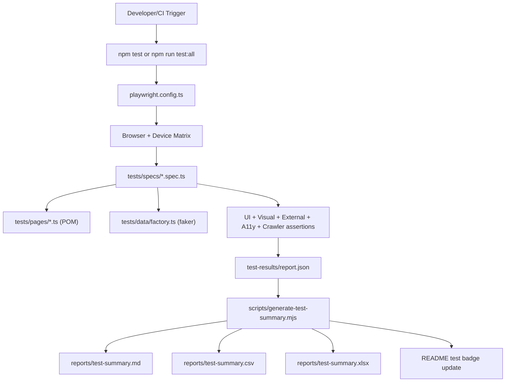

# Test Architecture

This project uses Playwright + TypeScript with a POM-first structure and tagged specs.

## Layers

- **Config layer**: base URL via `.env`, retry policy, reporter, matrix projects.
- **Spec layer**: feature-focused tests tagged by execution purpose.
- **POM layer**: reusable selectors and page interactions.
- **Data layer**: structured fake data generation for forms.
- **Reporting layer**: HTML + JSON + auto-generated summary files.

